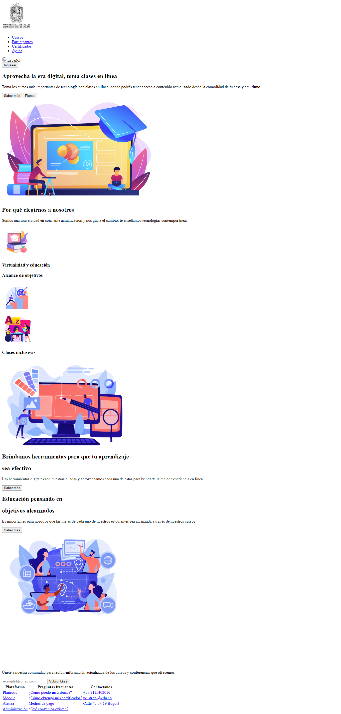

<h1>Taller 9 - Paula Andrea Pulido Ibarra</h1>
<h2>Información</h2>

Curso: Full Stack Basico - Grupo 1

Profesor: Cristian Patiño

<h2>Link de la página Web</h2>
<h2>Punto 1: Link de Figma</h2>
<a href= "https://www.figma.com/file/T2AIp0wyRqwKCEbl9iCVq7/Paula-Andrea-Pulido-Ibarra?type=design&node-id=0%3A1&mode=design&t=Wy7eNtE8donyi6v0-1">Link de Figma</a>

<h2>Punto 2: Diseño en HTML</h2>

<h2>Punto 3: Diseño en CSS</h2>

<h2>Punto 4: Títulos</h2>

<h2>Punto 5: Párrafo</h2>

<h2>Punto 6: Links</h2>

<h2>Punto 7 y 8: Barra de navegación</h2>

<h2>Punto 9: Tabla</h2>
